# Introducción.

>"Simularemos la infraestructura de dominio de una empresa mediante el despliegue de dos máquinas virtuales en VirtualBox: un servidor Windows Server para la administración centralizada de la red y un cliente Windows 10 Pro que actuará como la nueva estación de trabajo a integrar en el dominio."

>Para lograr nuestro objetivo, necesitaremos 3 elementos: 

- Windows Server.
- Windows 10 Pro.
- VirtualBox.

## Marco Conceptual.

>Reproduciremos en un entorno virtualizado(virtualbox), la infraestuctura de dominio que utiliza una organización. Para esto levantaremos 2 maquinas virtuales en v,irtualbox.

- Un servidor (Windows Server), que centralizará la administracion de la red.
- Un cliente (Windows 10 Pro), que representará una estacion de trabajo de un usuario que se incorpora al dominio.

### Conceptos Fundamentales: 

- **Servidor:** Equipo que provee servicios a otros (cuentas de usuario, permisos, servicios de red).
- **Dominio:** Repositorio central de identidades (usuarios y equipos).
- **Active directory:** Servicio que administra el dominio y almacena sus objetos.
- **DNS:** Servicio de resolucion de nombres; traduce nombres (**SRV-DC01**) a direcciones IP (**192.168.10.10**).
- **DHCP:** Servicio que asigna direcciones IP de forma automatica a los equipos de la red.
- **GPO (politicas de grupo):** Regla de configuración que se le define en el servidor y se aplica de forma centralizada a usuarios y equipos.

## Descargar Windows Server.

    
La descarga de Windows Server es bastante directa, asi que ingresamos al Link que esta bajo la imagen y buscamos la archivo .iso con el idioma que elijamos, en este caso es en español. Una vez hecho click en la seccion "edicion de 64 bit", comenzara la descarga.
 
    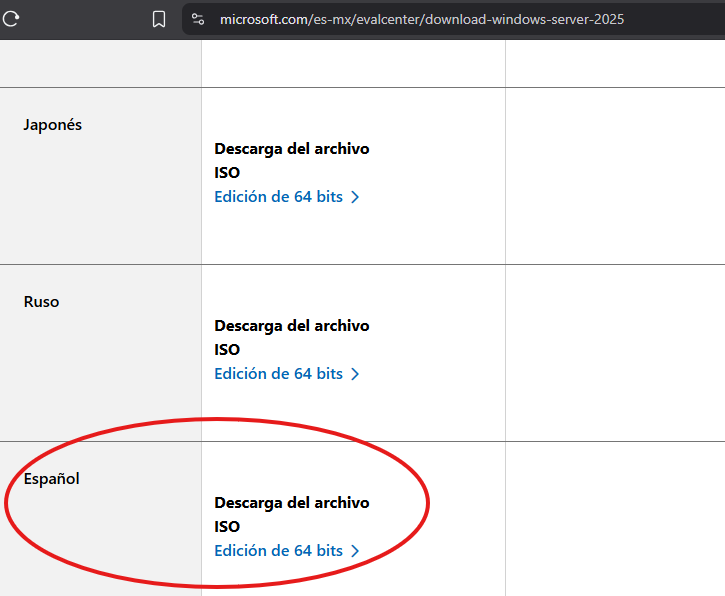

- Link Windows Server: [Windows Server](https://www.microsoft.com/es-mx/evalcenter/download-windows-server-2025). 

## Descargar Windows 10.

    
Para la descarga de Windows 10, ingresaremos al link que está bajo la imagen y haremos click en donde dice "descargar ahora".
 
    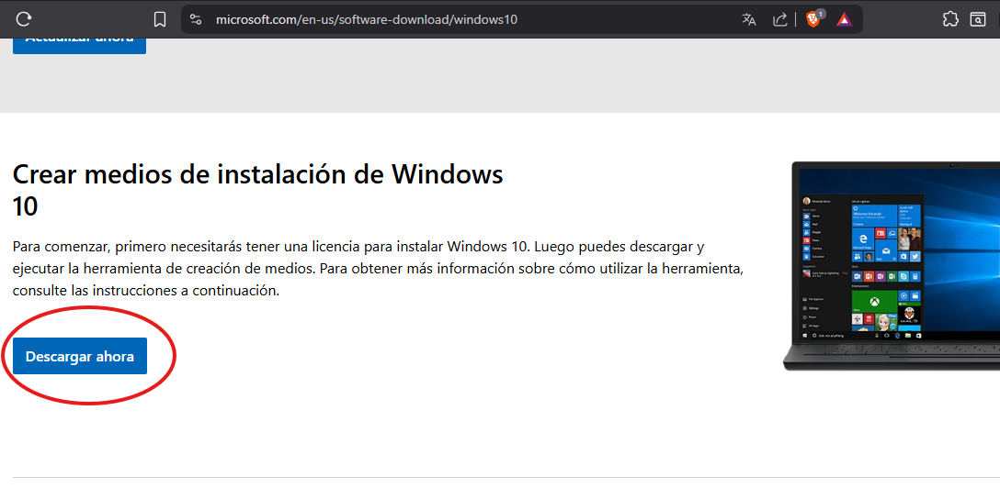

- Link Windows 10: [Windows 10](https://www.microsoft.com/en-us/software-download/windows10). 

>Una vez apretes para descargar.

    
Empezará la descarga de "MediaCreationTool", con esto podremos descargar Windows 10.
 
    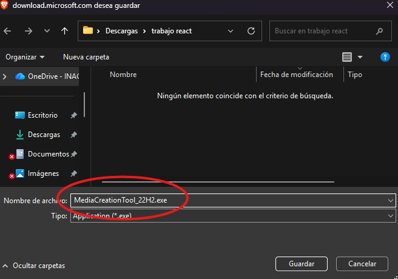

>Ejecutamos la Descarga.

    
Una vez terminada la descarga, buscamos la aplicación en la carpeta donde se guardo y ejecutamos como administrador.
 
    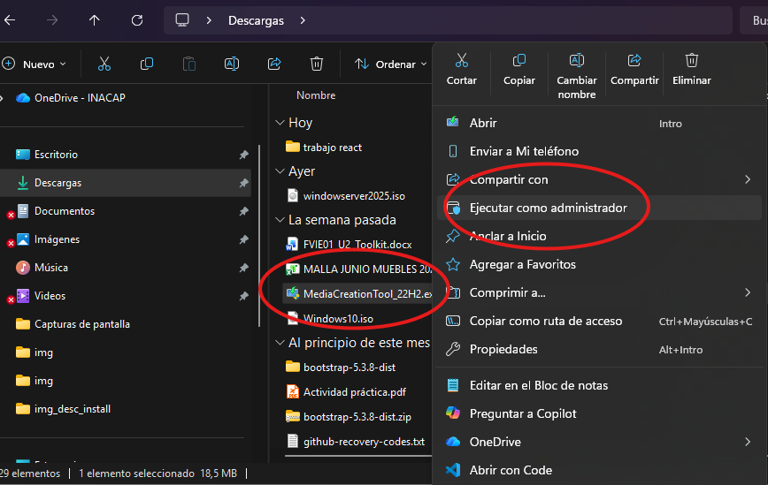

>Seguimos los pasos.

    
Una vez dentro, seguimos los pasos que se muestran en las siguientes imagenes. Aceptar los terminos y condiciones, elegimos lo que queremos hacer, seleccionamos el idioma y la arquitectura de Windows y por último marcamos que queremos una iso de windows 10.
 
    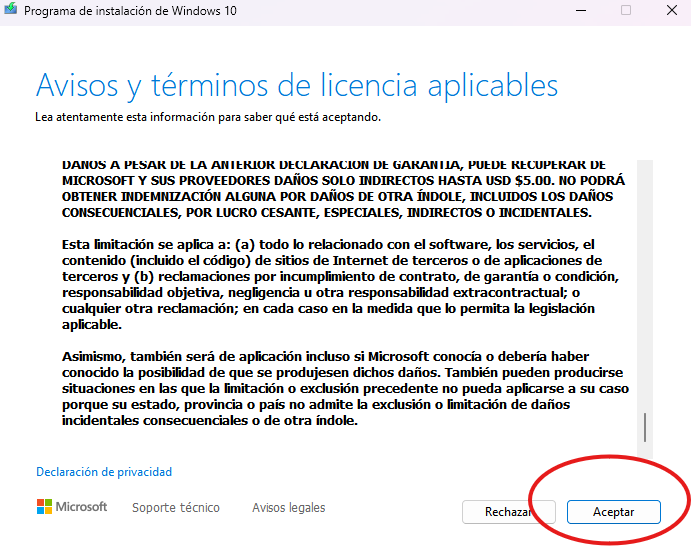
    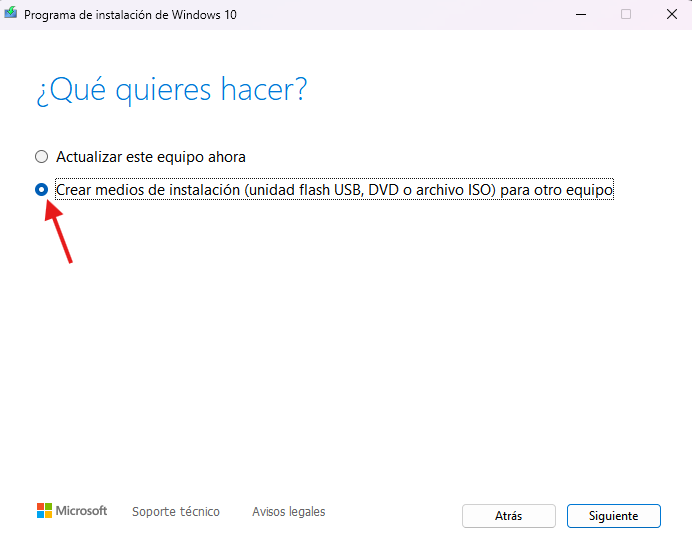
    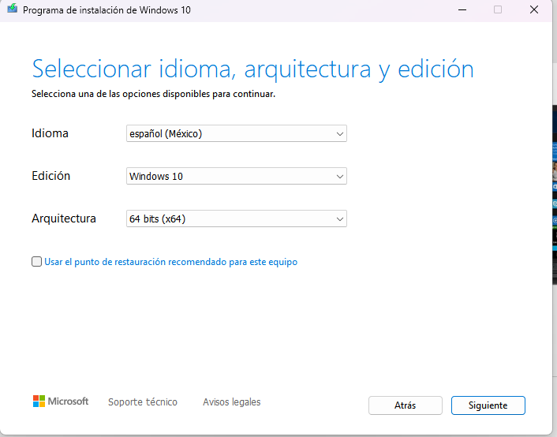
    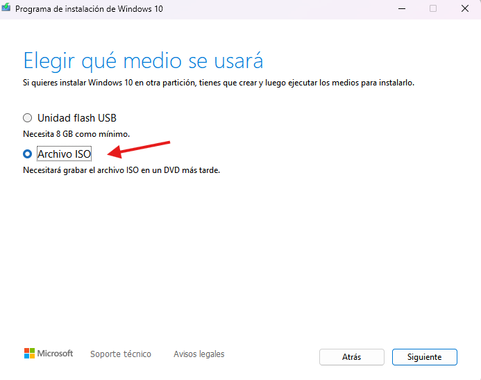

>Comienza la descarga de Windows 10.

    
Finalmente comenzara la descarga de Windows 10, solo falta decidir donde guardaras la iso.
 
    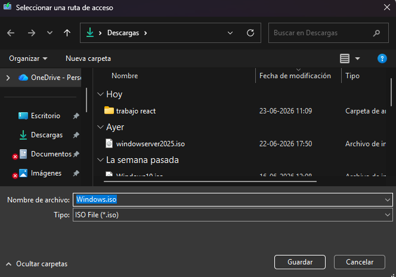

## Descargar Virtualbox.

    
Y por último pero muy importe, descargarmos virtualbox, link de descaga bajo la imagen, luego de entrar a la pagina, solo falta elegir la plataforma en la cual lo usarás, en este caso Windows.
 
    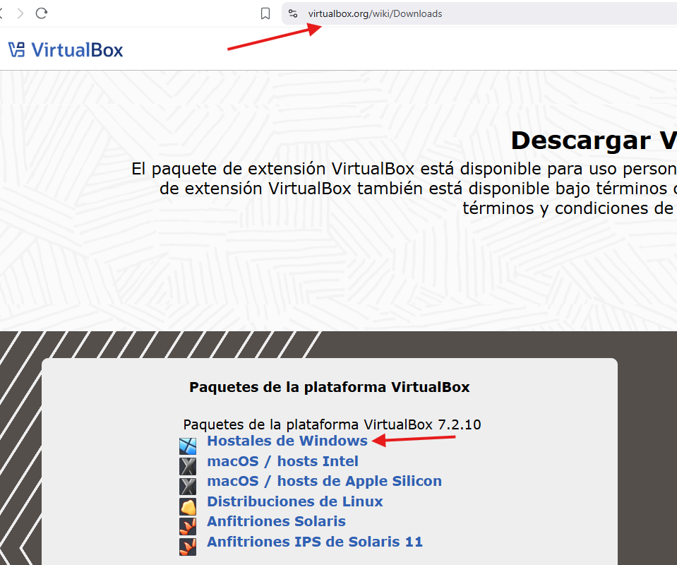

- Link Virtualbox: [Virtualbox](https://www.virtualbox.org/wiki/Downloads). 

    
Al ingresar en la instalacion de virtualbox solo hay que mantener todo lo que viene por defecto, una pequeña ayuda es dejar todo tal cual se muestra en las imagenes.
 
    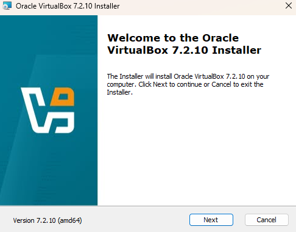
    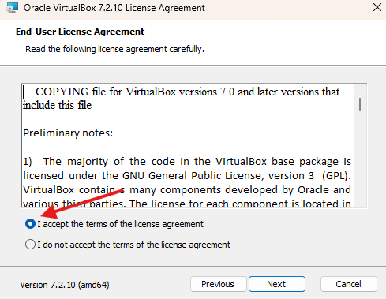
    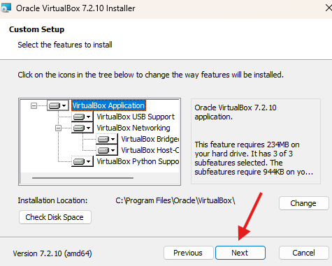
    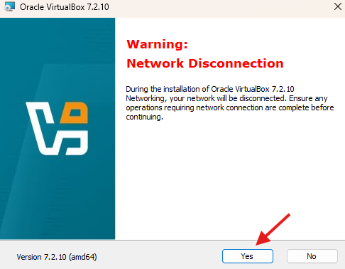
    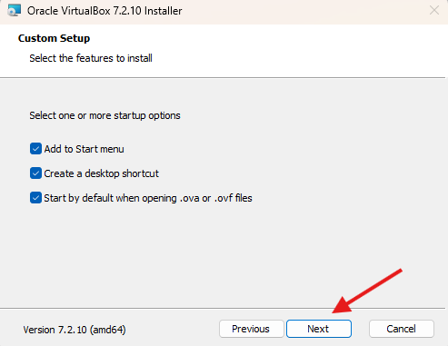
    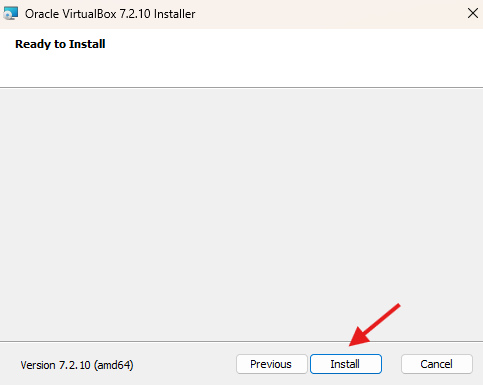

<!-- - [x] Tarea completada
- [ ] Tarea pendiente

*texto de tipo cursivo* o **texto en negritas**

| columna 1 | columna 2 | columna 3 |
| :--- | :---: | ---: |
| geovanni | quinteros | huerta |

    
.
 
    

 -->