# Instalación de Windows Server y Windows 10 Pro

### Requisitos básicos

- **Equipo de trabajo:** en lo posible, tener un equipo con al menos 8 GB de RAM y como mínimo unos 60 GB de disco duro libres.
- **Descargas:** VirtualBox, Windows Server y Windows 10 (ya las tenemos).

>Haremos un breve repaso de cómo montar las imágenes ISO de Windows Server y Windows 10 Pro en VirtualBox, los parámetros que usaremos para cada una de ellas y, finalmente, dejarlas listas para completar nuestro marco conceptual.

## Montar imágenes ISO en VirtualBox

    
Buscamos VirtualBox en el inicio de Windows y lo ejecutamos.

    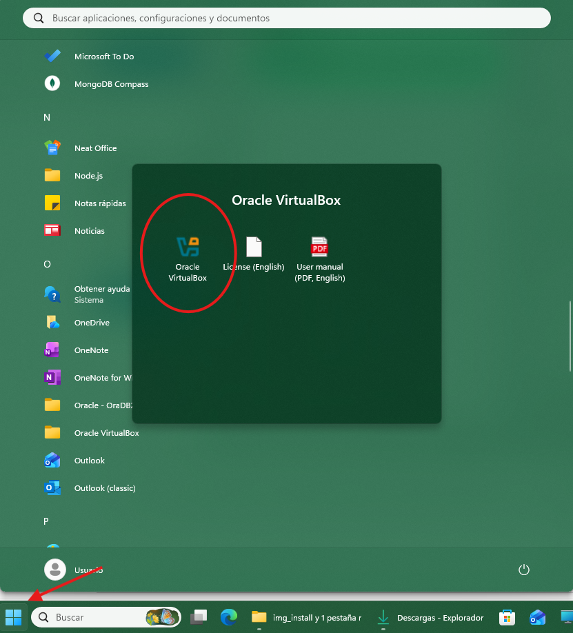

 
 
 
 

    
Lo que se encuentra a continuación aplica tanto para Windows Server como para Windows 10. Le asignaremos un nombre a nuestras virtualizaciones; en este caso lo haré con Windows 10 y lo nombraré «PC01», ya que este será nuestro cliente. Para el caso del servidor (Windows Server) le asignaremos el nombre de «SRV-DC01». Una vez hecho esto, buscamos la imagen ISO y la seleccionamos como se muestra en la imagen.

    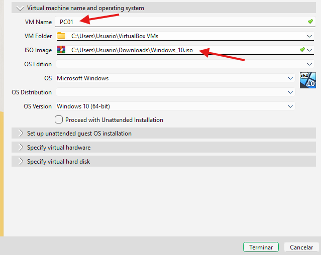

 
 
 
 

    
Ahora nos dirigimos a la pestaña de «Especificaciones del hardware virtual» y definimos la cantidad de memoria RAM, que en este caso le asignaré 4 GB aproximadamente, y con 4 núcleos (pueden asignarle hasta 2 núcleos y aun así funciona).

    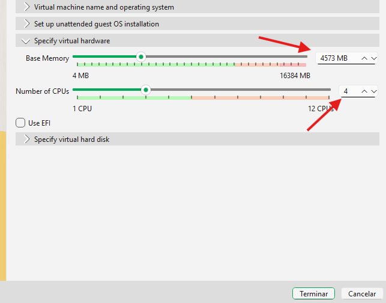

 
 
 
 

    
Ahora nos dirigimos a la pestaña donde dice «Especificaciones del disco duro virtual» y le asignamos unos 50 GB, y finalmente apretamos «Terminar».

    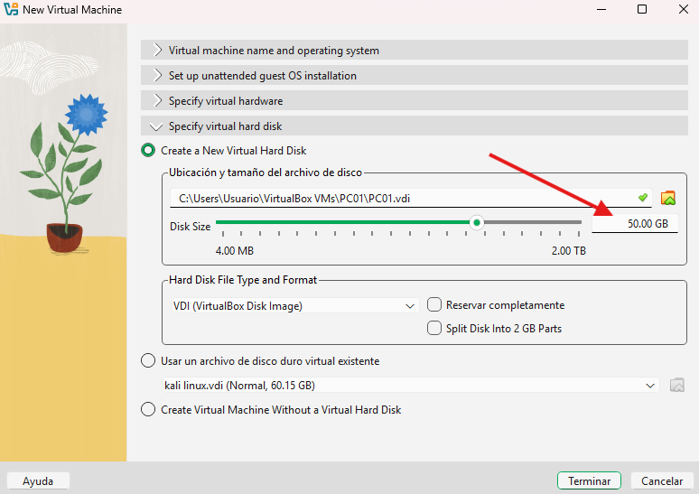

 
 
 
 

    
Ahora vamos a hacer que ambas máquinas virtuales estén en red. ¿Cómo lo logramos? Seleccionando cualquiera de las imágenes montadas y después haciendo clic en la ruedita amarilla. Posteriormente nos dirigimos a la pestaña que dice «Red», marcamos arriba en «Experto» y cambiamos en «Conectar a» por «Red interna». Abajo le asignamos un nombre, «redlab», y así finalmente apretamos «Aceptar».

    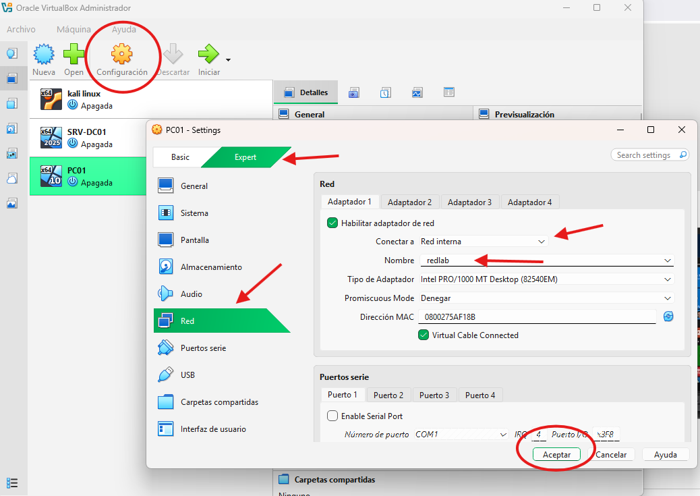

 
 
 
 

    
Aquí una comparativa de ambas máquinas virtuales; tienen los mismos parámetros.

    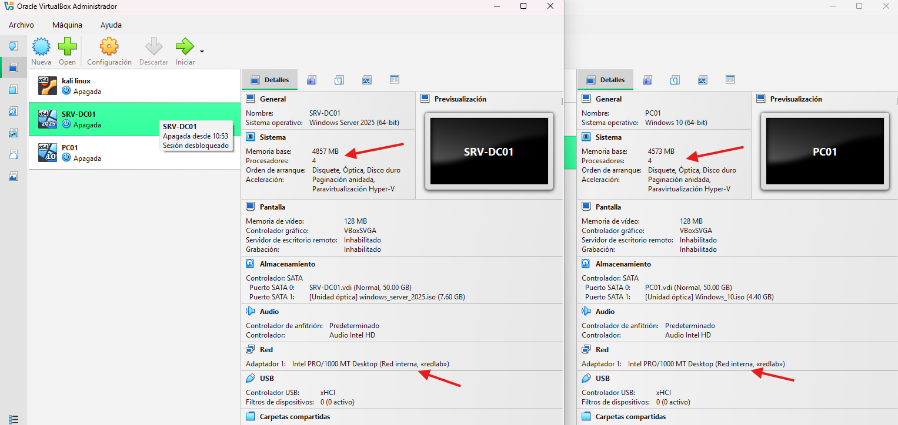

 
 
 
 

    
Y ya para finalizar, para ejecutar la emulación, solo debes apretar la flecha verde que dice «Inicio».

    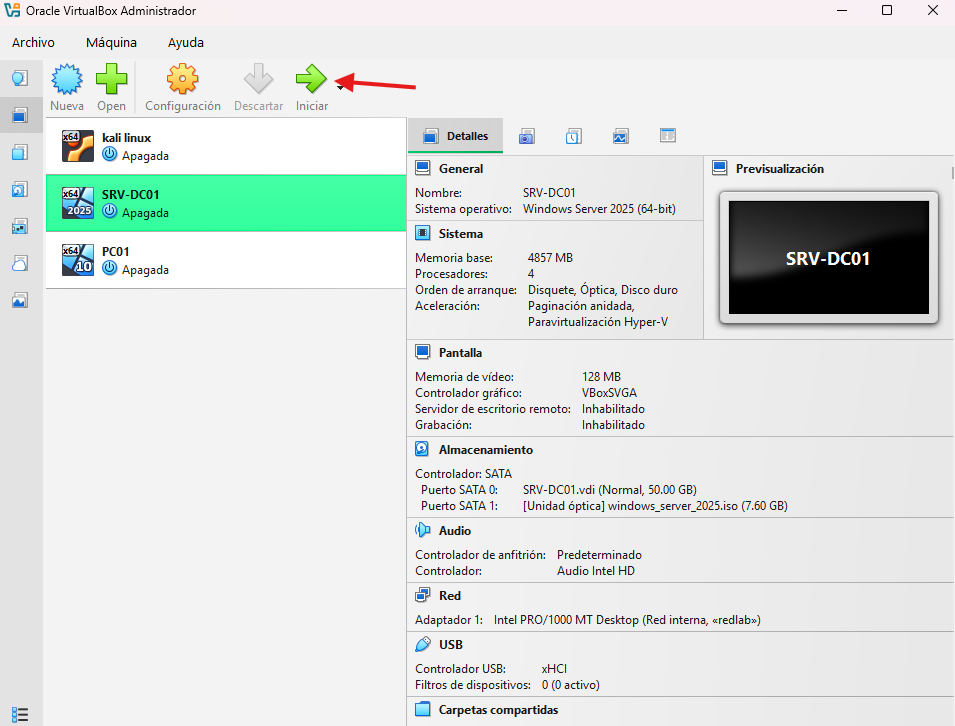

 
 

## Instalación Windows Server

    
Después del paso anterior se ejecutará el sistema de instalación; lo primero es elegir el idioma del sistema y tu zona horaria.

    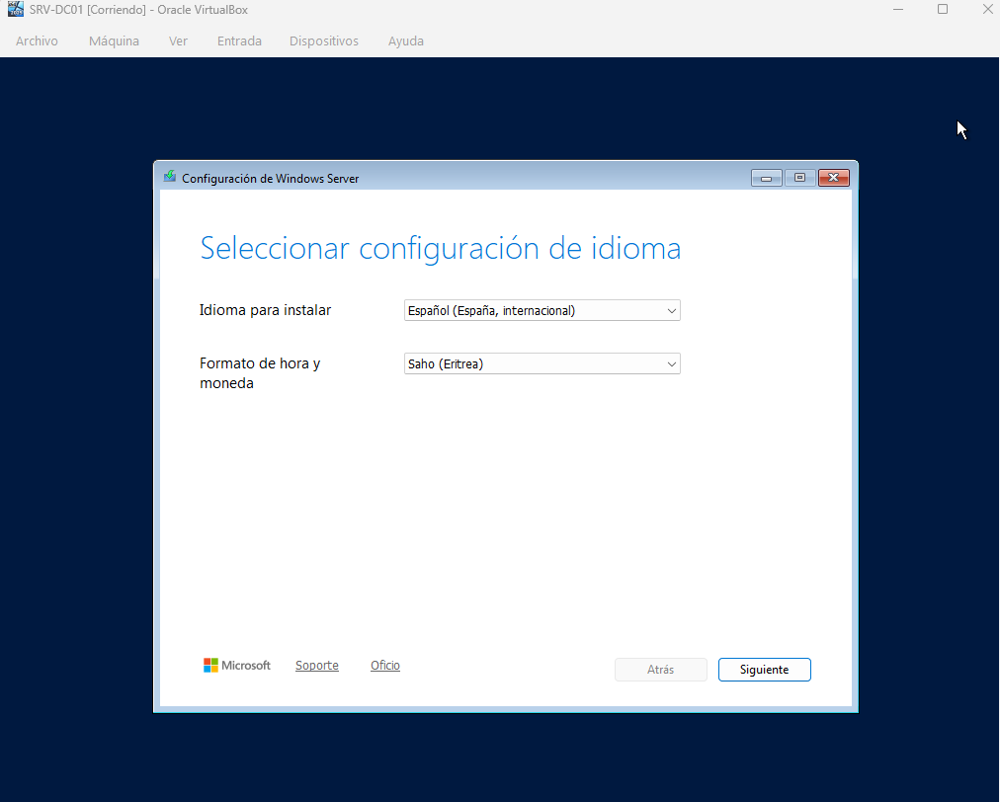

 
 
 
 

    
Seleccionamos el idioma del teclado, en este caso español.

    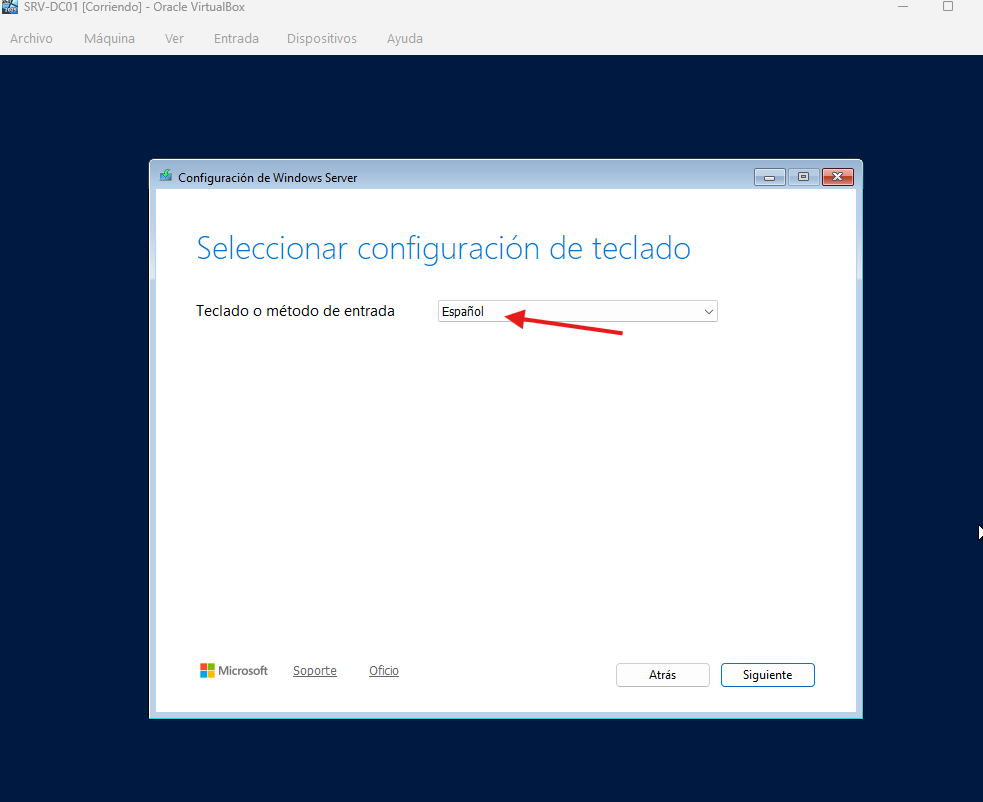

 
 
 
 

    
Seleccionamos el tipo de instalación, que en este caso es Windows Server (se sugiere marcar la línea de abajo).

    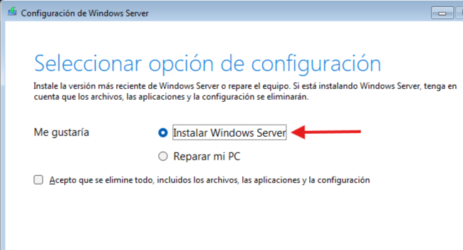

 
 
 
 

    
Ya en este punto es importante seleccionar el adecuado, que en este caso será «Windows Server Standard Evaluation».

    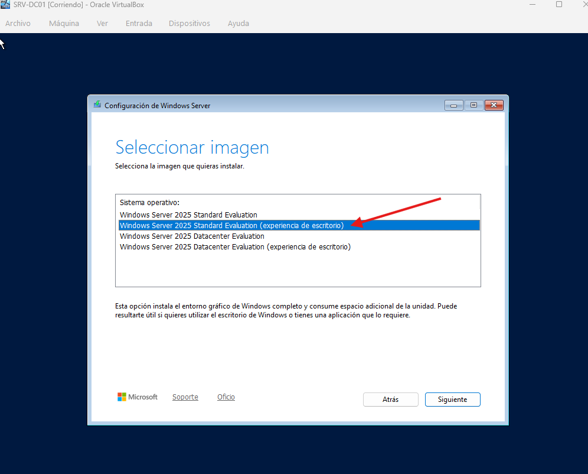

 
 
 
 

    
Ahora seleccionamos el disco donde vamos a instalar nuestra virtualización (todo esto es un lugar aislado de tu PC real, no afectará de ninguna forma).

    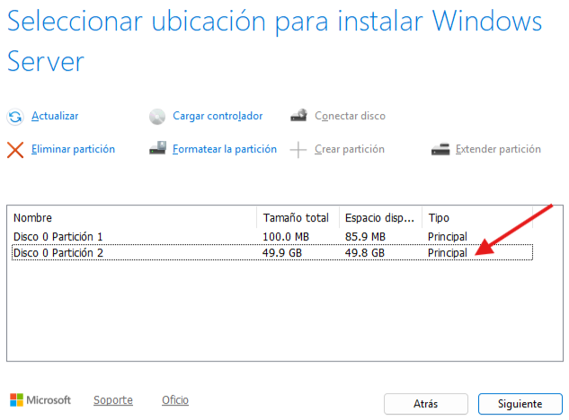

 
 
 
 

    
Ya estamos listos; solo queda presionar donde dice «Instalar» y esperar a que la instalación termine.

    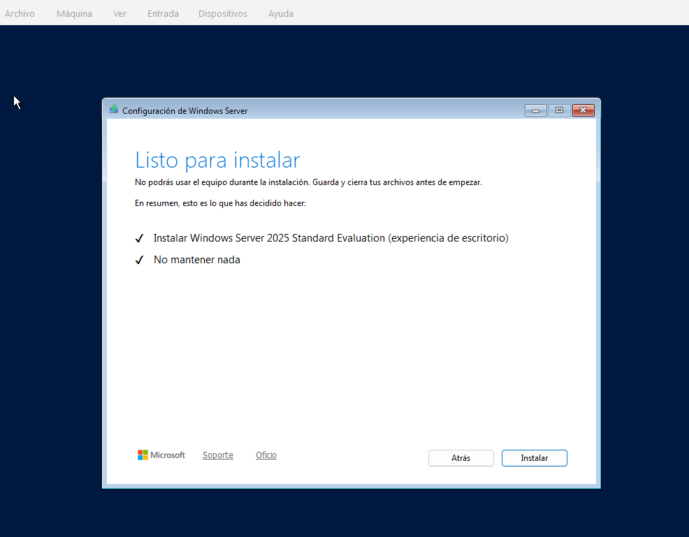

 
 
 
 

### Configurar una IP fija

>El equipo se reiniciará varias veces; solo deja que termine la instalación.

    
En este punto pedirá ingresar una contraseña; dicha contraseña consta de al menos una letra mayúscula, al menos un número y al menos un carácter.

    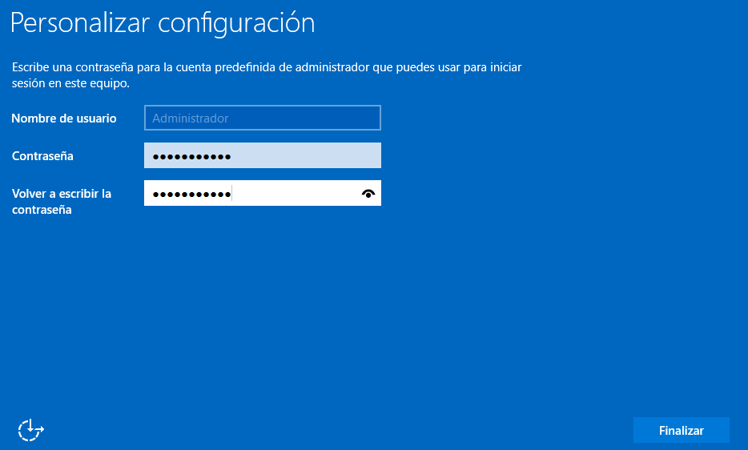

> [!WARNING]
> **NO OLVIDES LA CONTRASEÑA QUE INGRESASTE, YA QUE ESTA NO SE PUEDE RECUPERAR.**

 
 
 
 

    
Como pantalla de inicio nos pedirá ingresar presionando Ctrl + Alt + Del; esto podría afectar a nuestro computador y arruinar todo, así que por este motivo nos dirigimos a la parte superior de la pantalla y seguimos la ruta que se muestra en la imagen.

    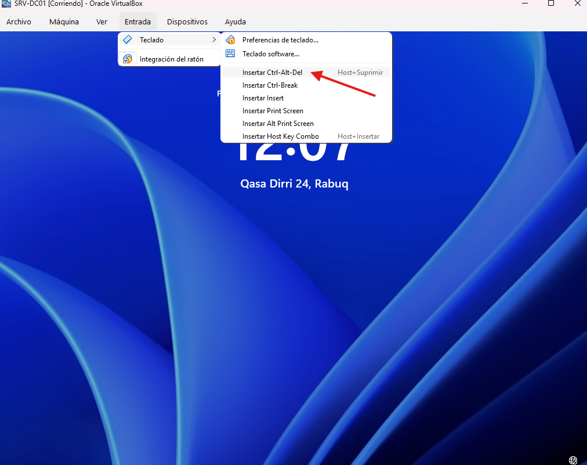

 
 
 
 

    
A continuación ingresamos la contraseña que definimos anteriormente.

    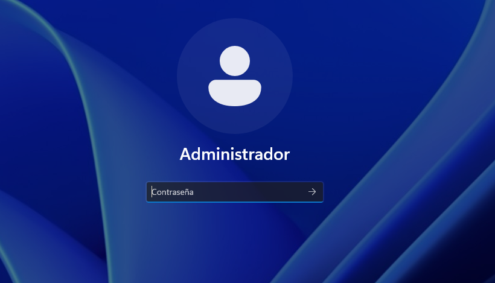

 
 
 
 

    
Una vez iniciado Windows, se ejecuta automáticamente el «Administrador del servidor». En el costado izquierdo entramos en «Servidor local», luego en «Ethernet».

    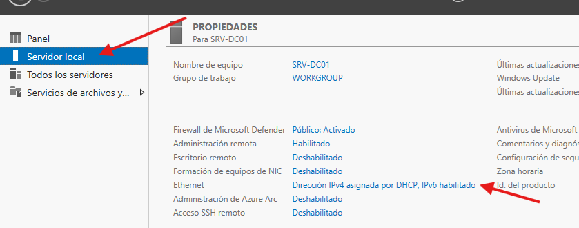

 
 
 
 

    
Una vez dentro, clic derecho y «Propiedades».

    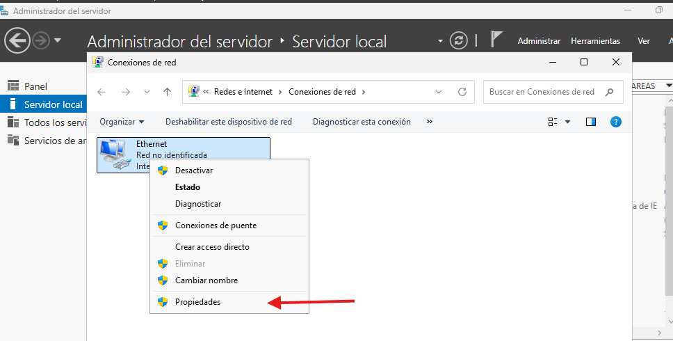

 
 
 
 

    
Protocolo de Internet versión 4 y luego marcamos «Usar la siguiente IP».

    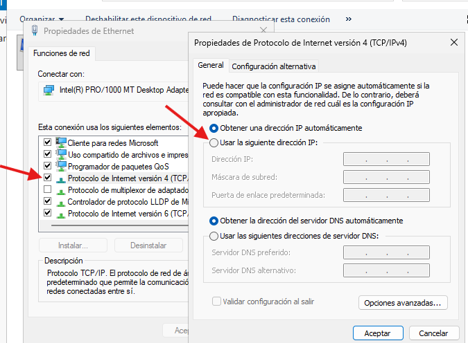

 
 
 
 

    
Llenamos los parámetros como se muestra en la imagen y finalmente aceptamos; ya con esto dejamos fija la IP del servidor.

    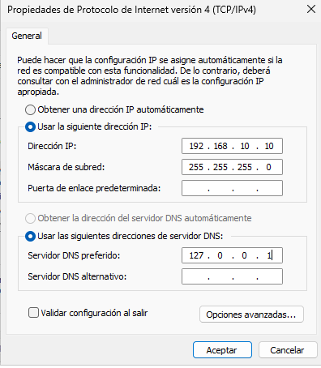

 
 
 
 

### Cambiar nombre del servidor

    
En «Administrador de Servidor» ingresamos a «Servidor local», clic en «Nombre de equipo», se despliega una ventana, vamos a «Cambiar» y ahí finalmente ingresamos el nombre que elijamos, en este caso será «SRV-DC01».

    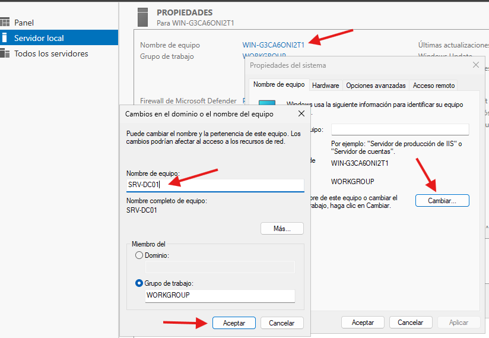

 
 
 
 

    
Una vez hechos los cambios, el equipo nos pedirá reiniciar y lo hacemos.

    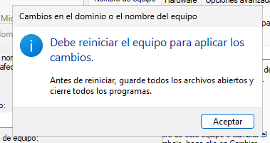

 
 
 
 

## Instalación Windows 10 Pro

>La instalación de Windows 10 es muy similar y comparte varios pasos en los que es igual a la instalación de Windows Server.

    
Nos da la bienvenida el sistema de instalación con 3 configuraciones inmediatamente: el idioma del sistema, el país y el idioma del teclado.

    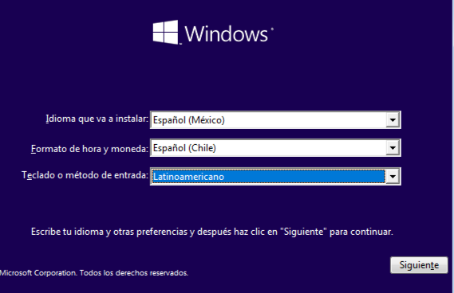

 
 
 
 

    
Aquí nos mostrará las posibles distribuciones de Windows 10 que podemos instalar; en este caso, instalaremos «Windows 10 Pro».

    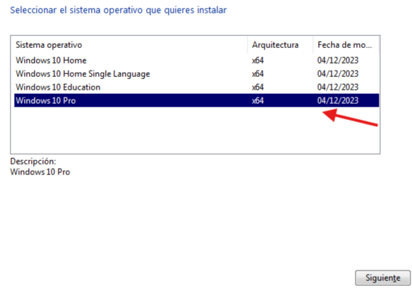

 
 
 
 

    
Seleccionamos la instalación personalizada.

    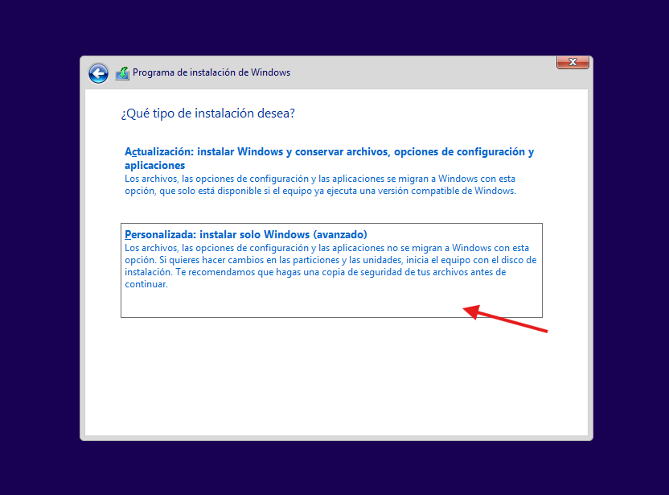

 
 
 
 

    
Elegimos el disco donde se instalará nuestra virtualización. Posterior a esto, esperamos a que la instalación termine.

    

 
 
 
 