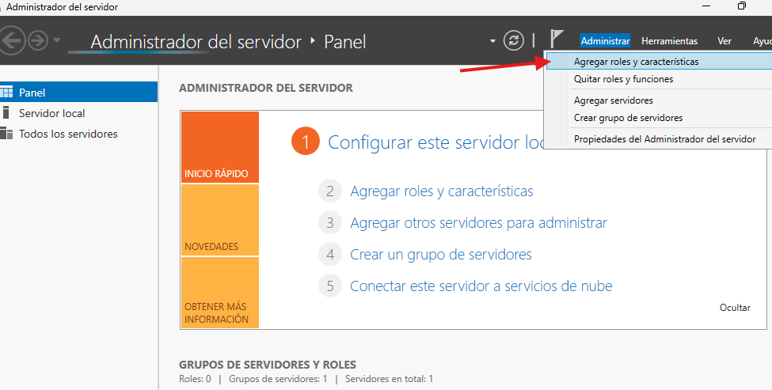
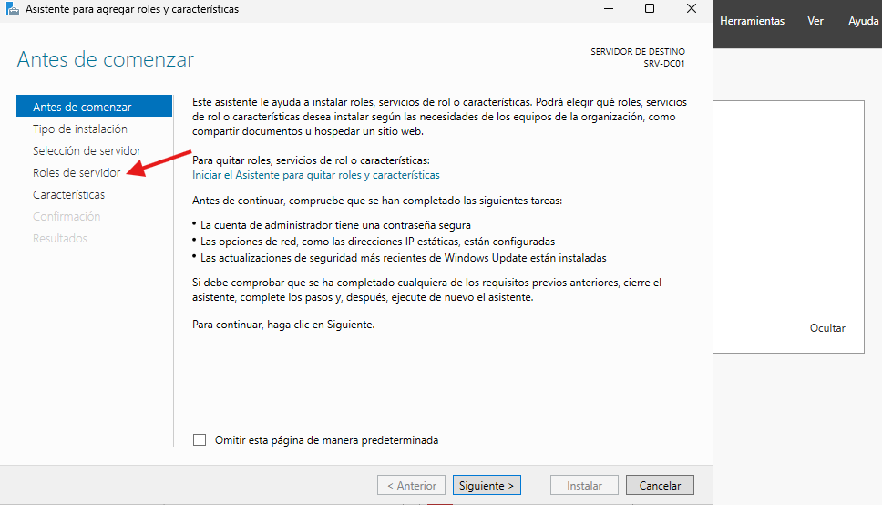
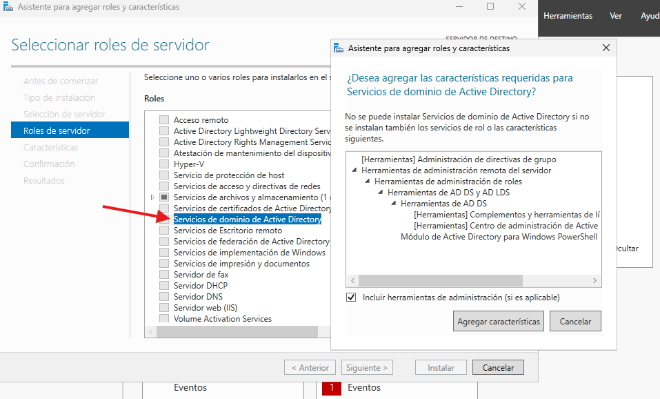
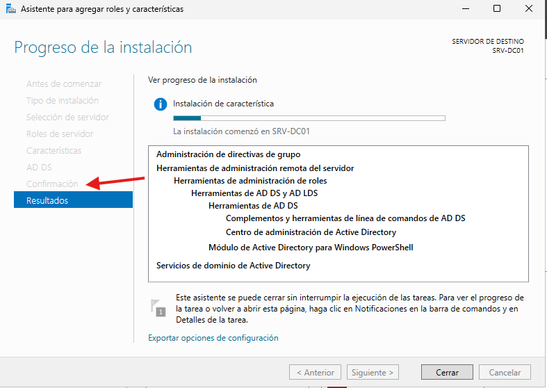
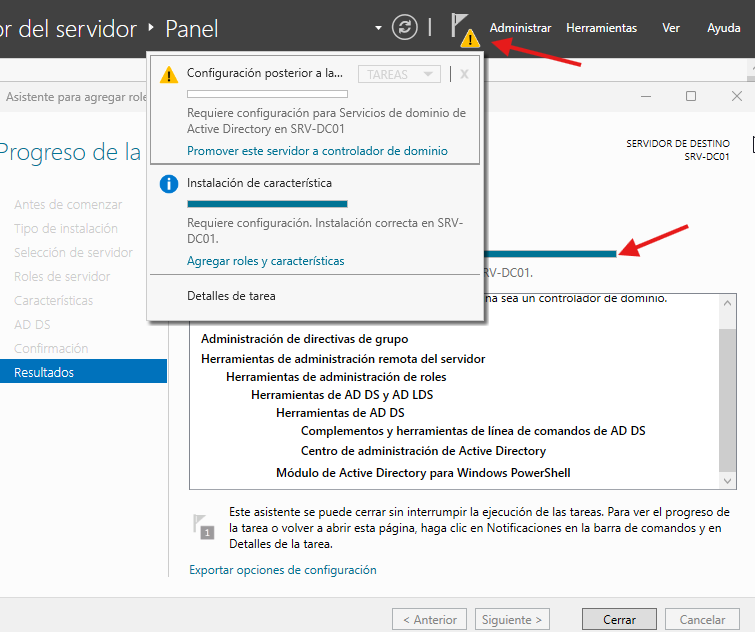
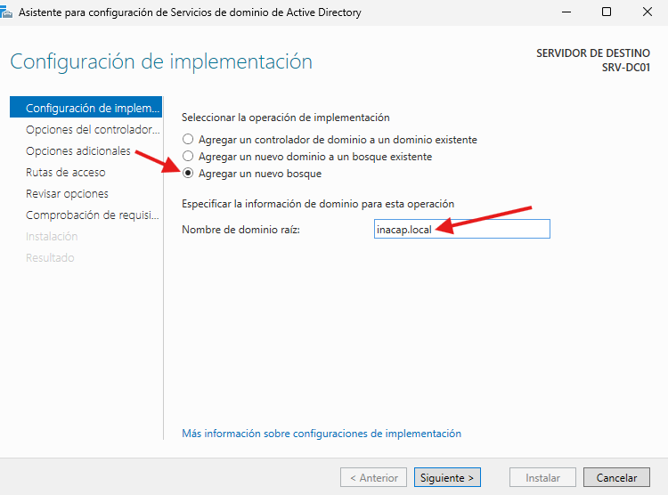
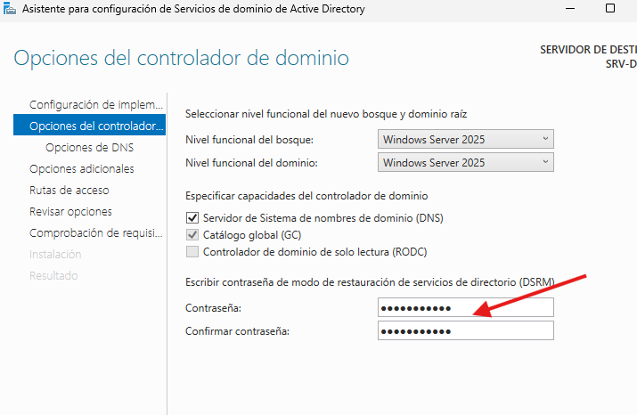
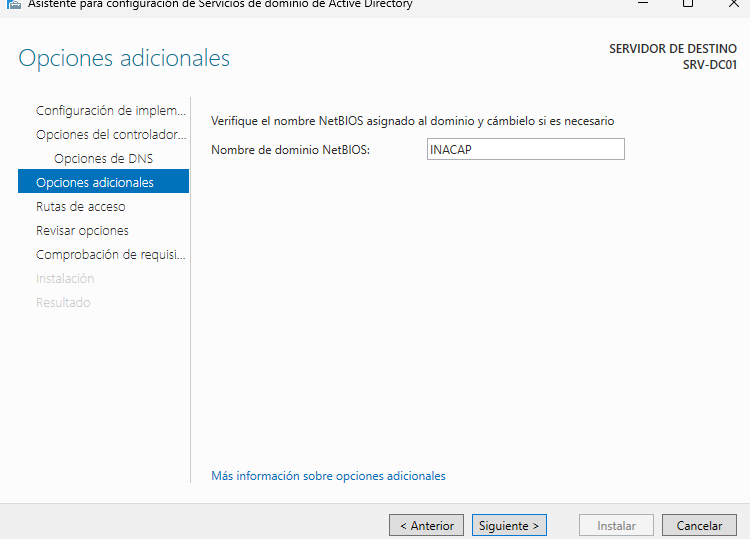
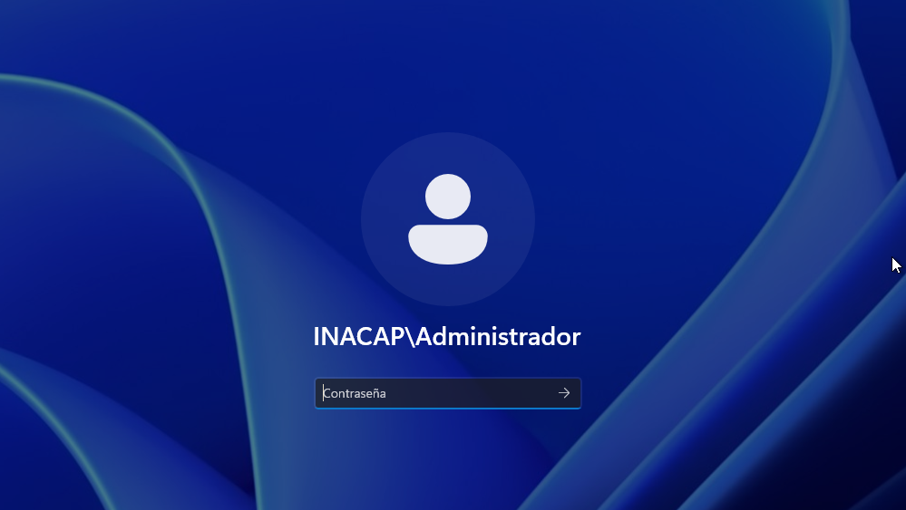

# Active Directory.

>Su función principal es facilitar la administración de los recursos de una red informática empresarial. Sirve específicamente para:

- **Centralizar la Autenticación (Inicio de Sesión único):** Los usuarios no se loguean localmente en la computadora física; se loguean en la red de la empresa. Con una sola cuenta y contraseña, el empleado puede acceder a su computadora, a las carpetas compartidas de la red, a las impresoras y a los correos, según sus permisos.

- **Control de Accesos y Seguridad:** Permite al administrador definir de manera estricta quién tiene derecho a ver o modificar qué cosas dentro de la organización.

- **Gestión de Directivas (GPO):** Permite aplicar reglas masivas a miles de computadoras a la vez desde el servidor. Por ejemplo: bloquear el uso de memorias USB, forzar un fondo de pantalla corporativo, exigir contraseñas seguras que cambien cada 30 días, o instalar un software automáticamente en todos los equipos.

    
En "Administrador de servidor" nos dirigimos a "Administrar" y luego a "Agregar roles y caracteristicas".
 
    

 
 
 
 

    
Una vez dentro, le damos a siguiente hasta llegar a "Roles de servidor".
 
    

 
 
 
 

    
Acá marcamos "Servivios de dominio de Active Directory" y le damos a siguiente.
 
    

 
 
 
 

    
Pasado esto, dar a siguiente hasta que comience la instalacion.
 
    

 
 
 
 

    
Una vez completada la barra de instalacion, aparecera una alerta en el banderin de la parte superior, desplegamos y entyramos a "Promover este servidor a controlador de dominio".
 
    

 
 
 
 

    
Luego marcamos "Agregar nuevo bosque" y anotamos "Nombre de dominio raiz".
 
    

 
 
 
 

    
En "opciones de controlador" dejamos todo tal cual la imagen y finalmente ingresamos nuestra contraseña de Administrador.
 
    

 
 
 
 

    
Le damos siguiente hasta llegar a "Opciones adicionales" y agragamos el nombre de la netBIOs de nuestra preferencia.
 
    

 
 
 
 

    
Una vez terminado reiniciamos la maquina, y cuando lleguemos al momento de ingresar nuestra contraseña, veremos el resultado al crear el dominio.
 
    

 
 
 
 