# Dominio De Cliente.

>Ahora nos toca la creacion de una nueva unidad organizativa y tambien un par de usuarios.

- ### Creacion de Unidad Organizativa.

    
Esta vez nos dirigiremos a "Herramientas" (Parte superior).
 
    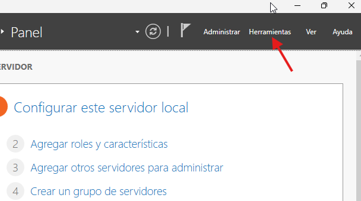

 
 
 
 

    
Nos dirigimos a "Usuarios y equipos de Active Directory".
 
    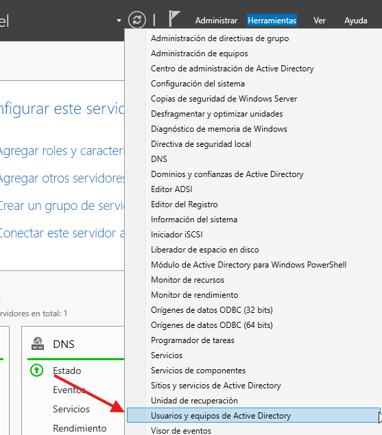

 
 
 
 

    
Una vez dentro, click derechom en el dominio creado y seguimos la siguiente ruta "Nuevo" y luego "Unidad Organizativa".
 
    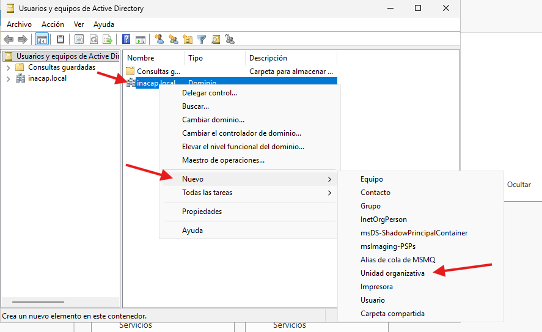

 
 
 
 

    
Le asignamos el nombre y creamos la unidad.
 
    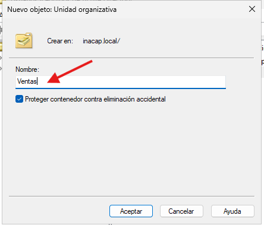

 
 
 
 

- ### Creacion de Usuario.

    
Mismo proceso que en el caso anterior, con la diferencia que nos dirigimos a "Usuario".
 
    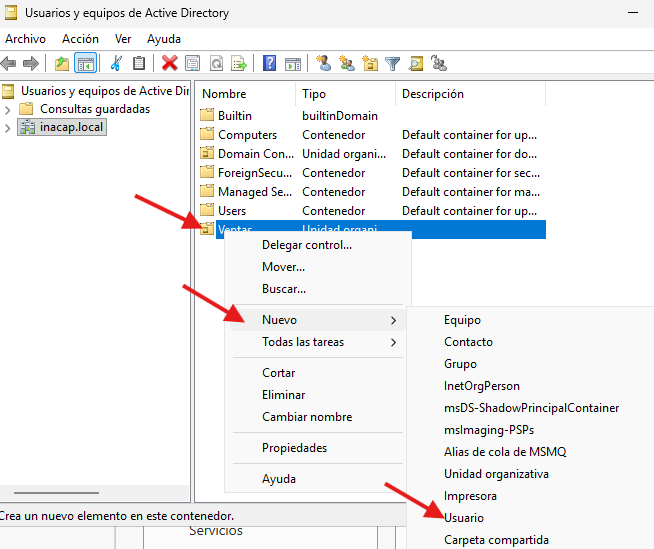

 
 
 
 

    
Llenamos los campos con lo que se nos pide y le damos siguiente.
 
    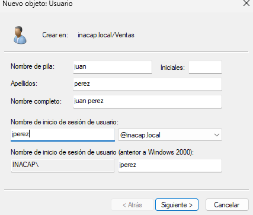

 
 
 
 

    
Le asignamos una contraseña y desmarcamos la primera casilla.
 
    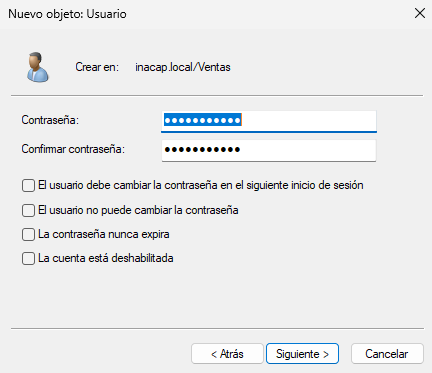
    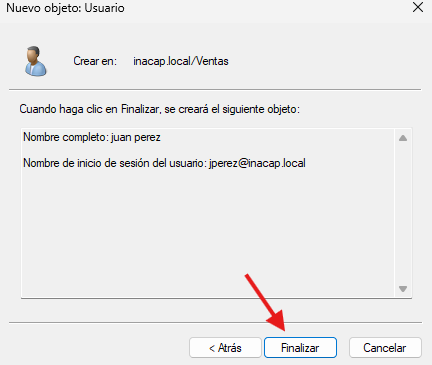

 
 
 
 

- ### Creacion de Grupo.

    
Nos posicionamos sobre la unidad antes creada, repetimos el proceso antes descrito y elegimos grupo esta vez.
 
    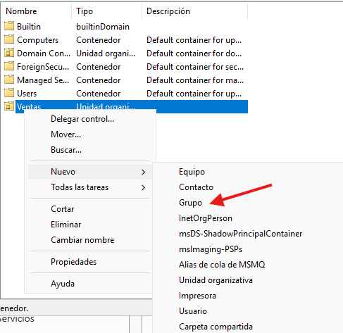

 
 
 
 

    
En este punto ya podemos visualizar dos usuarios creados y un grupo, selecionamos a uno de los usuarios, click derecho y propiedades, "Miembro de" y "Agregar".
 
    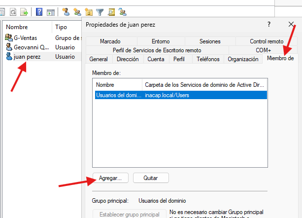

 
 
 
 

    
Anotamos al grupo (Objeto) al que deseamos ingresar al usuario y aceptamos.
 
    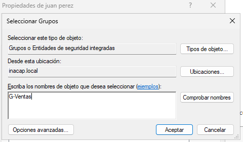

 
 
 
 

    
Finalmente revisamos los miembros del grupo y listo.
 
    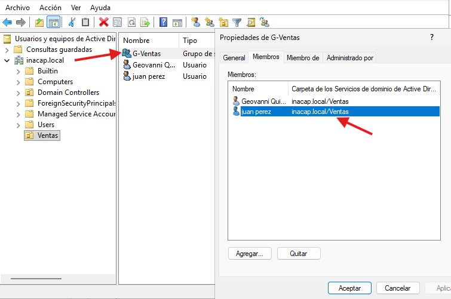

 
 
 
 