# Servicios de red

>En esta sección determinaremos lo que tiene que ver con la asignación de IPs y cuál será el rango que tendrá para asignar a los usuarios.

### Servicio DHCP

    
Para empezar debemos levantar el «Servicio de DHCP», así que nos dirigimos a «Administrar» y luego a «Agregar roles y características».

    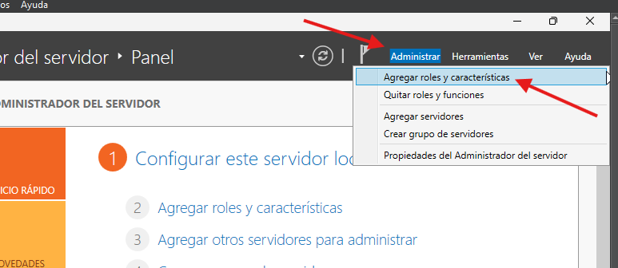

 
 
 
 

    
Luego, a «Servicio DHCP» y posterior a «Agregar características».

    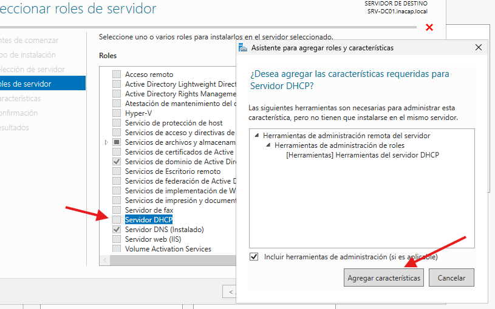

 
 
 
 

    
En este punto le damos a «Siguiente» hasta el punto de apretar «Instalar».

    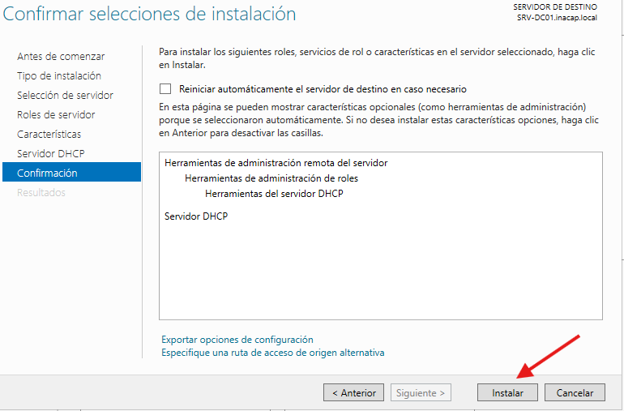

 
 
 
 

    
Se nos repite lo mismo que en la instalación de «Active Directory»; una vez cargada la barra, nos fijamos en el banderín que está en la parte superior.

    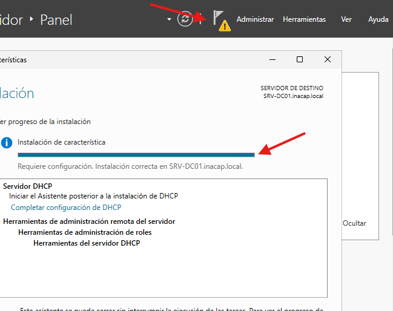

 
 
 
 

    
Ahora sí completamos la instalación de DHCP.

    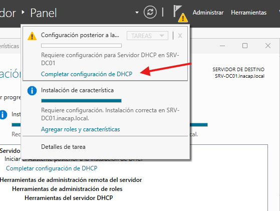

 
 
 
 

    
Ahora sí cerramos la instalación.

    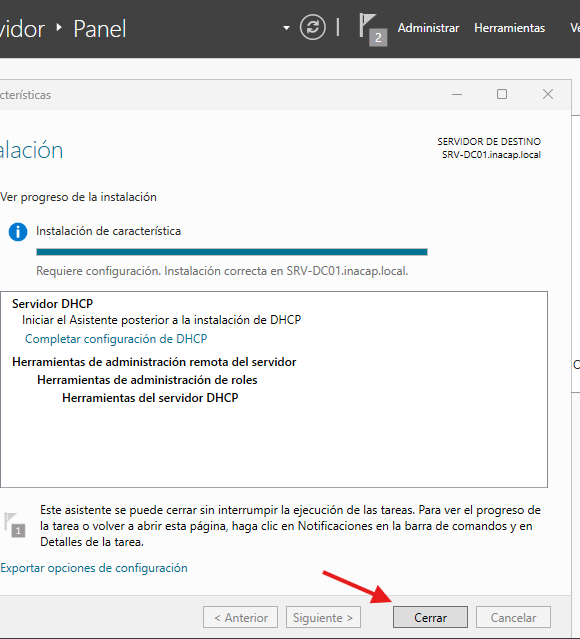

 
 
 
 

    
Una vez instalado el servicio, nos dirigimos a «Herramientas» y buscamos «DHCP».

    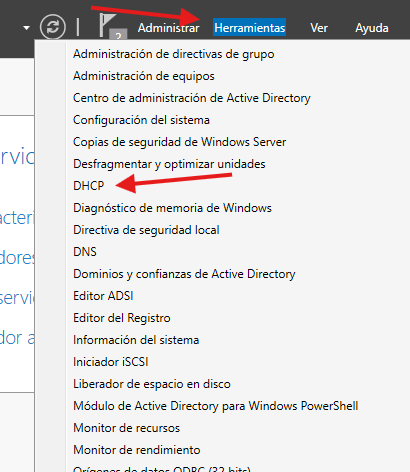

 
 
 
 

    
Una vez dentro de «DHCP», nos dirigimos a IPv4 y hacemos clic derecho, luego en «Ámbito nuevo».

    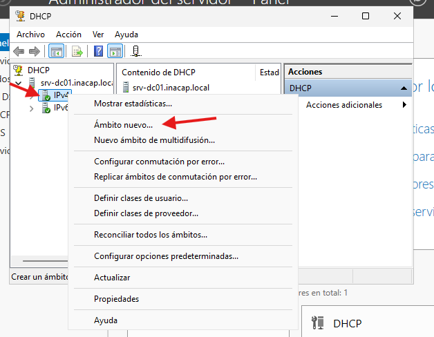

 
 
 
 

    
Aquí asignaremos el rango donde queremos que las IPs de usuarios estén; en este caso serán 50 IPs, con rangos de 25 (llenar la tabla según la imagen).

    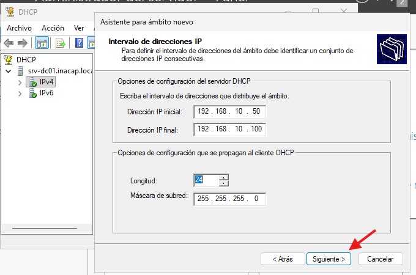

 
 
 
 

    
Le damos a «Siguiente» sin anotar nada más, hasta llegar a esta parte, en donde marcamos que queremos configurar las opciones ahora.

    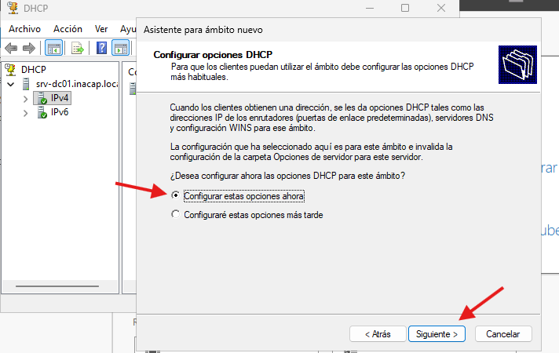

 
 
 
 

    
En este punto estamos determinando un enrutador, con el fin de que, si los otros usuarios que pertenezcan a esta red deben dirigirse a esta dirección IP para poder salir del entorno local.

    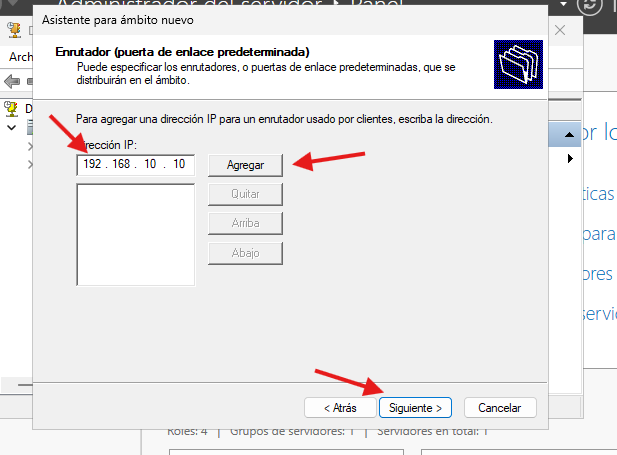

 
 
 
 

    
Escribimos nuestro dominio, siguiente, activamos el ámbito y siguiente; ya terminamos esta parte.

    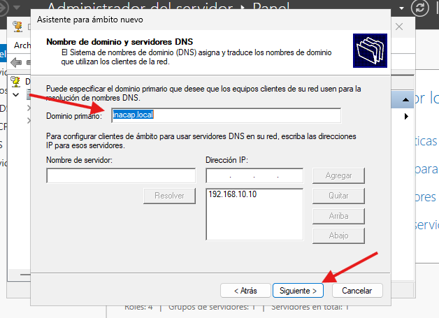
    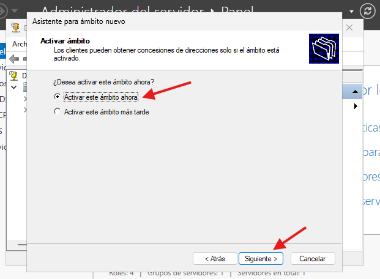

 
 
 
 

### Integrar a un nuevo usuario

    
Ahora cambiamos de máquina y trabajamos con la máquina usuario.

    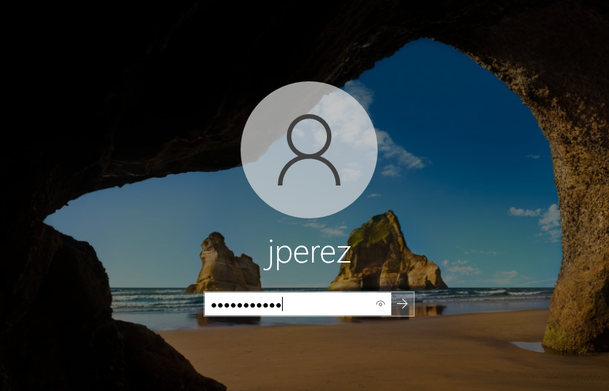

 
 
 
 

    
Una vez dentro de la máquina, nos salta un mensaje de que estamos unidos a la red local (al preparar las máquinas virtuales, las enlazamos a través de una red interna).

    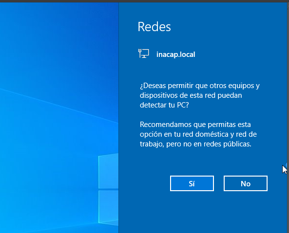

 
 
 
 

    
Buscamos la consola y la ejecutamos como administrador.

    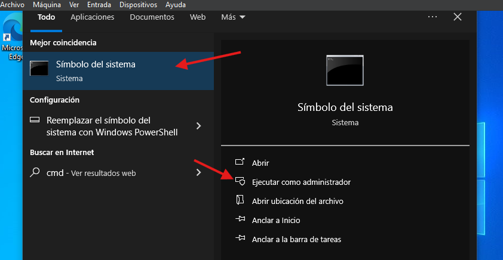

 
 
 
 

    
Una vez dentro de la consola escribimos: <code>ipconfig</code> y ejecutamos con Enter; nos muestra la información de que nos encontramos conectados a la red local y con una IP asignada. Después de esto escribimos: <code>ping 192.168.10.10</code>, esto nos conectará a la misma IP que el servidor.

    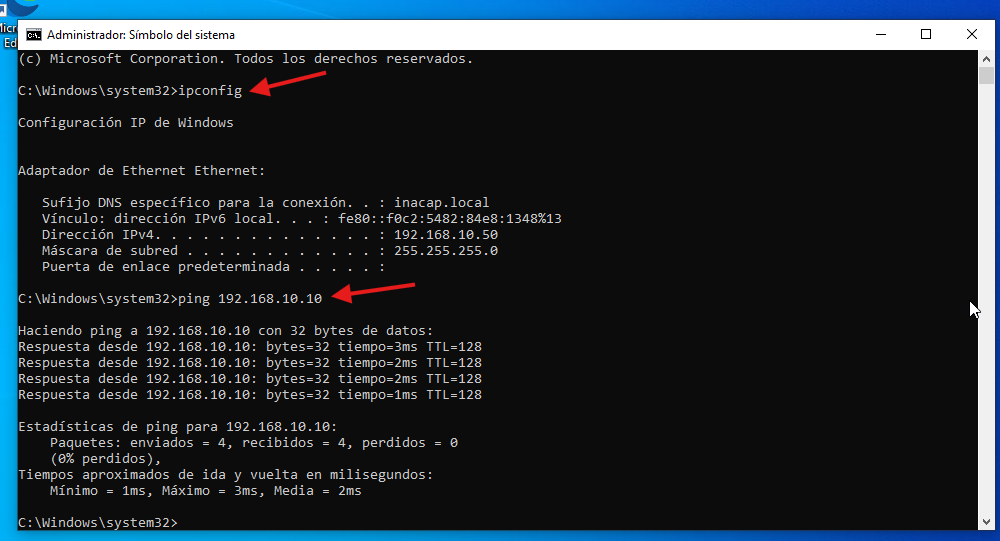

 
 
 
 

    
Abrimos una vez más la consola y anotamos el siguiente comando: <code>sysdm.cpl</code>; gracias a esto entraremos al dominio que habíamos establecido anteriormente.

    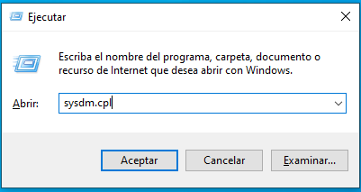

 
 
 
 

    
Hacemos clic en «Cambiar», como se muestra en la imagen.

    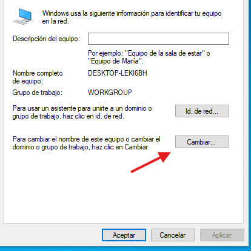

 
 
 
 

    
Nos dirigimos al apartado «Miembro de», seleccionamos «Dominio» y escribimos el nombre del dominio. A continuación nos pedirá autorización del administrador del dominio; por esto y más, es muy importante no olvidar la contraseña.

    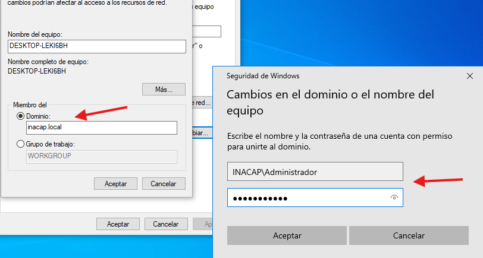
    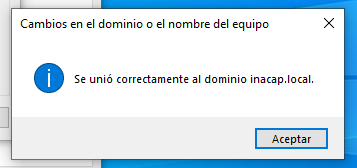

 
 
 
 

    
Al reiniciar la máquina, seguirá igual todo aparentemente, así que nos dirigimos a «Otro usuario» para que cambie la pantalla de inicio.

    
    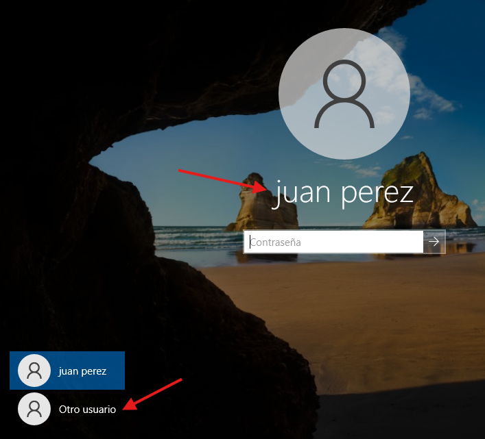

 
 
 
 

    
Una vez dentro, abrimos una consola y, para tener la certeza de que hemos hecho bien todo, anotamos el siguiente comando: <code>whoami</code>. «INACAP\jperez» es la respuesta; con esto confirmamos que estamos dentro del dominio que queríamos.

    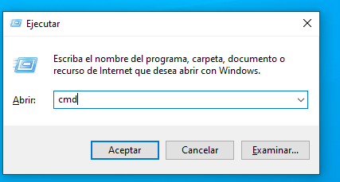
    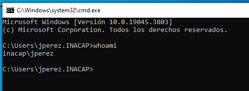

 
 
 
 
