# GPO (Politicas De Grupo).

>Aca configuramos las reglas que defininmos en en el servidor y que se aplicaran de forma centralizada en los equipos de los usuarios. La iidea de centralizar es gestionar el resto de equipos desde un unico punto en lugar que equipo por equipo.

- ## GPO.

>En esta seccion, deshabilitaremos la posibilidad de que allgun usuario pueda cambiar los fondos de pantalla o hacer algun otro tipo de cambio en la configuracion.

    
Entramos a Administracion de directivas de grupo.
 
    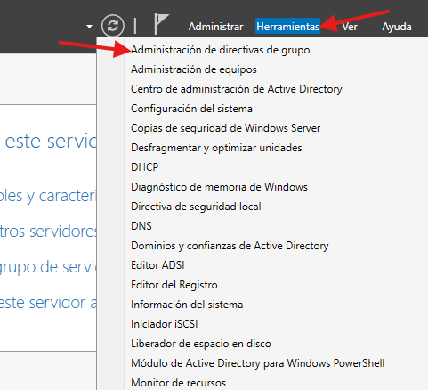

 
 
 
 

    
Nos vamos a Ventas y click derecho, primera opcion.
 
    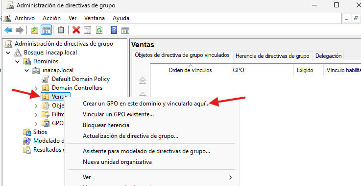

 
 
 
 

    
Ingresamos un nombre.
 
    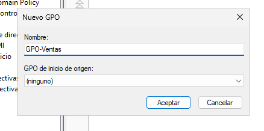

 
 
 
 

    
Hace click derecho en el GPO recien agregado y seguimos la ruta mostrada en la imagen.
 
    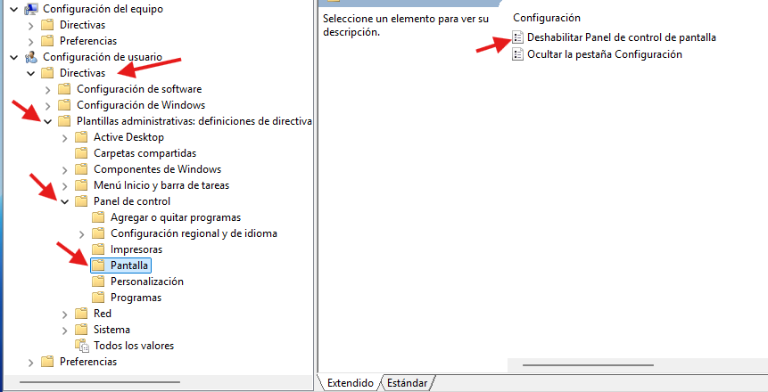

 
 
 
 

    
Habilitamos. aplicamos y aceptamos.
 
    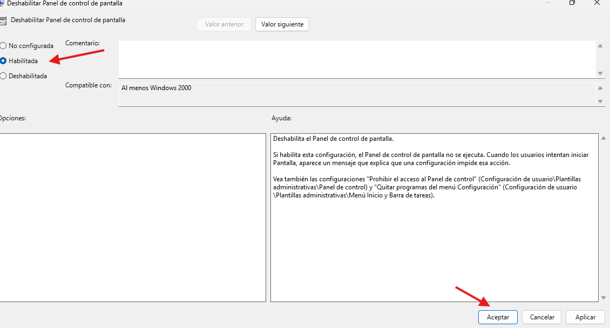

 
 
 
 

    
Para ver si lo que acabamos de hacer tiene algun resultado, entramos en la maquina de cliente, abrimos una consola y escribimos el siguiente comando: gpupdate /force... con esto forzamos a la maquina a actualizar y cualquier cambio hecho se vera reflejada.
 
    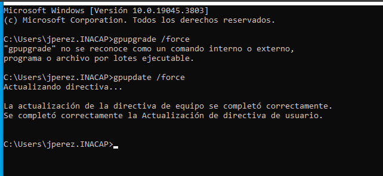

 
 
 
 

    
Intentamos acceder al panel de control o alguna configuracion de pantalla, y nos arroja este mensaje o simplemente no se abre la aplicacion... Exito !! hemos bloqueado al usuario para realizar cambios.
 
    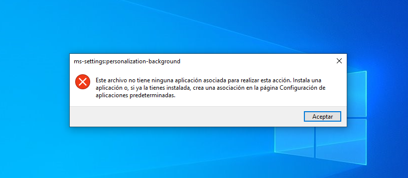

 
 
 
 

- ## Desafio.

>Pondremos como fondo de pantalla una imagen institucional, esto logrado de forma centralizada (desde nuestro servidor). 

    
Crearemos la carpeta donde se guardara .
 
    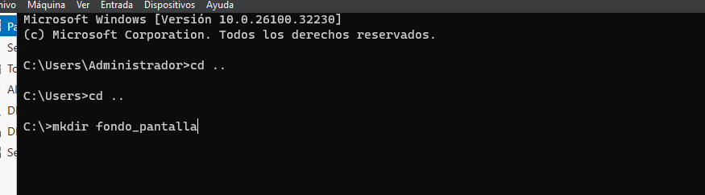

 
 
 
 

    
Verificamos la ruta y encontramos la carpeta.
 
    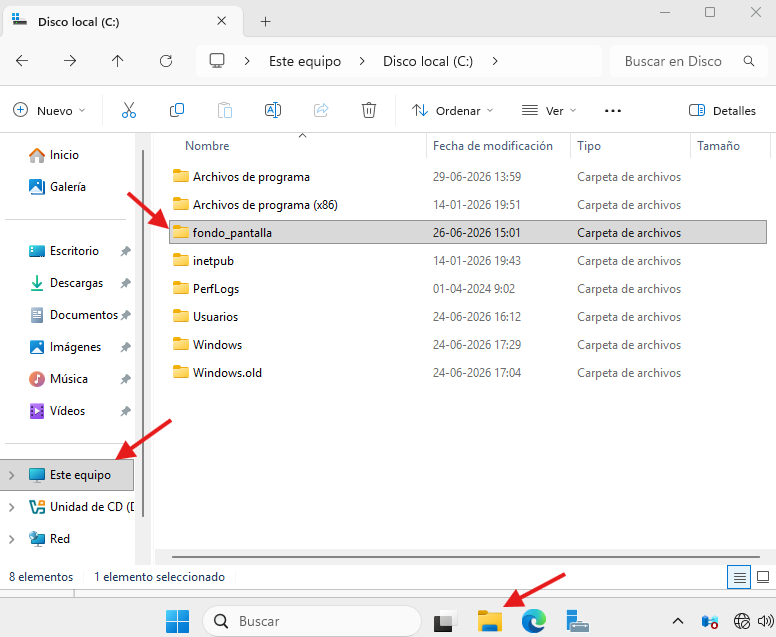

 
 
 
 

    
Esta sera la imagen a establecer como fondo de pantalla.
 
    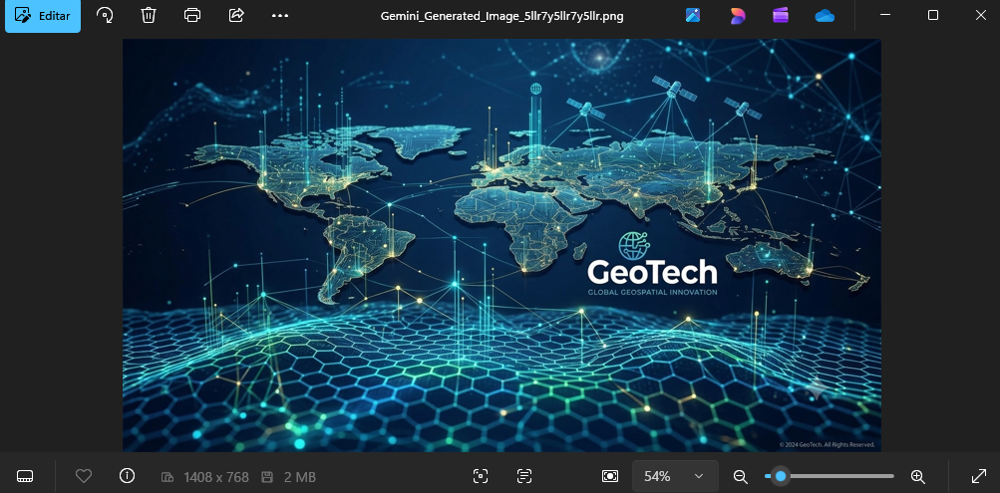

 
 
 
 

    
Copiamos la imagen en la carpeta que creamos.
 
    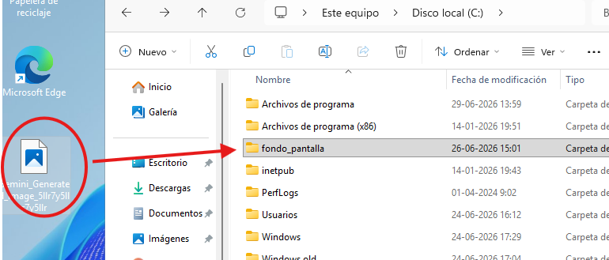

 
 
 
 

    
Click derecho en la carpeta creada, vamos a propiedades, luego compratir y seguimos la ruta que se muestra en la imagen, finalizamos aceptando.
 
    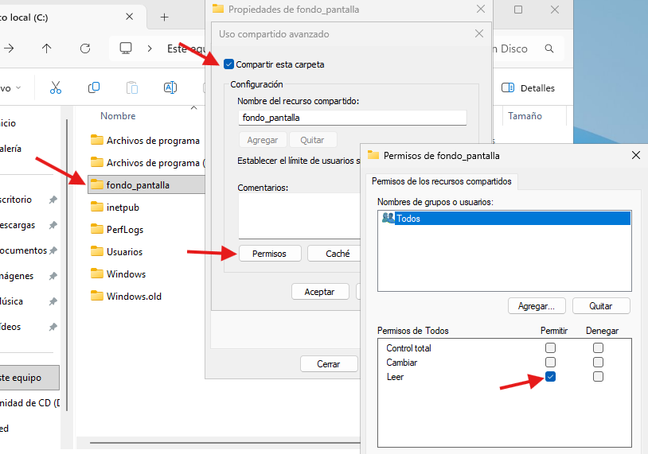

 
 
 
 

    
Copiamos la ruta de donde esta la imagen que usaremos.
 
    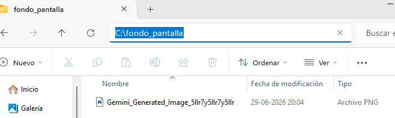

 
 
 
 

    
Nos dirigimos a Administracion de directivas de grupo.
 
    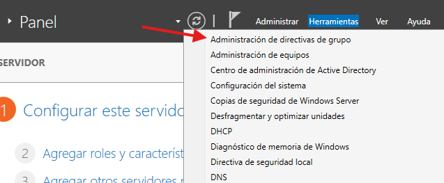

 
 
 
 

    
Creamos un Nuevo GPO.
 
    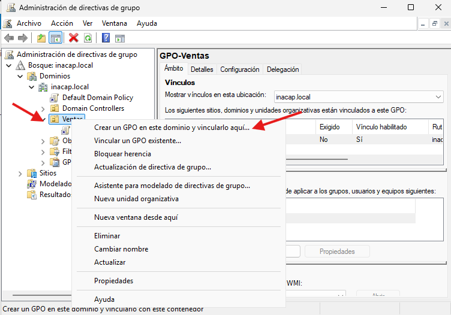

 
 
 
 

    
Le damos un nombre descriptivo.
 
    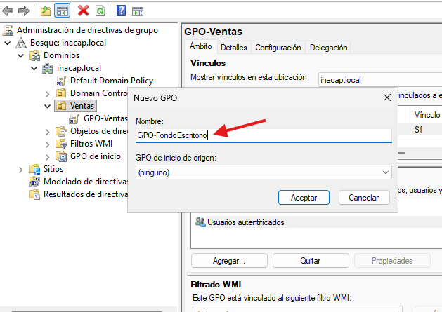

 
 
 
 

    
Click derecho para editar el GPO reciencreado.
 
    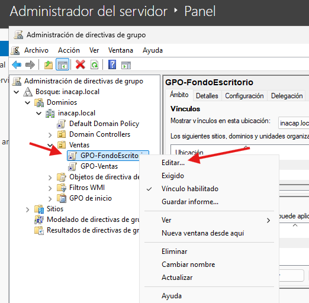

 
 
 
 

    
Seguimos la ruta señalada en la iamgen.
 
    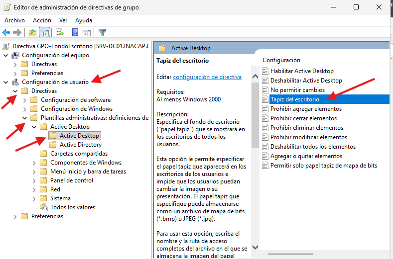

 
 
 
 

    
Habilitamos, pegamos la ruta seguida por \nombre_fondo.jpg y aplicamos y listo.
 
    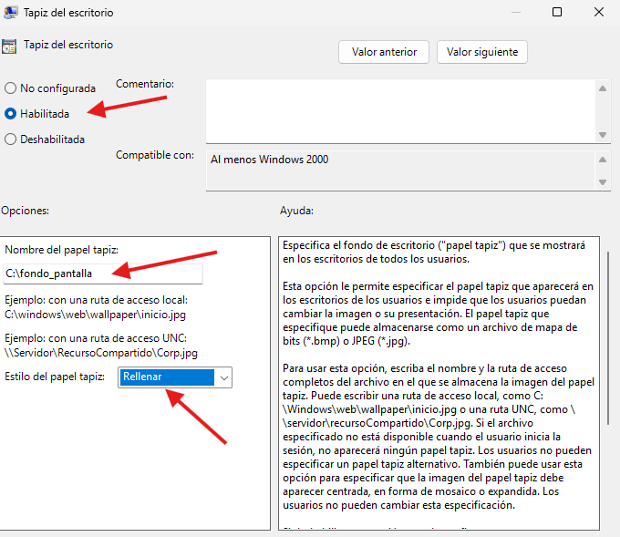

 
 
 
 

    
Verificamos en la maquina de cliente si se genero el cambio.
 
    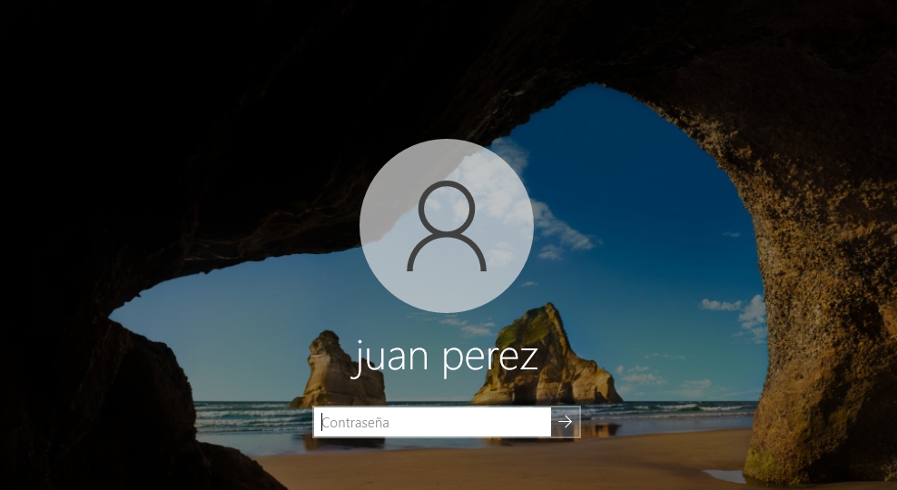

 
 
 
 

    
Maravilloso!!! hemos centralizado el cambio desde nustra maquina servidor.
 
    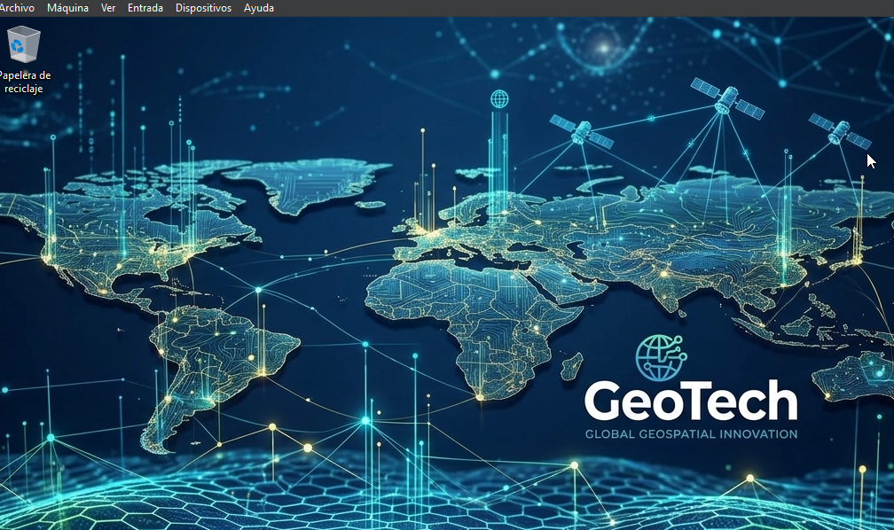

 
 
 
 